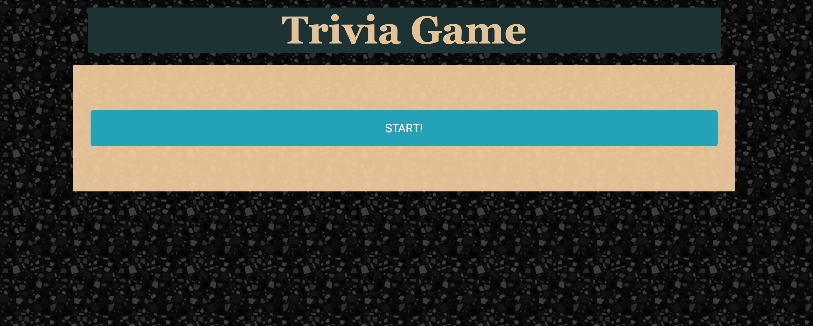
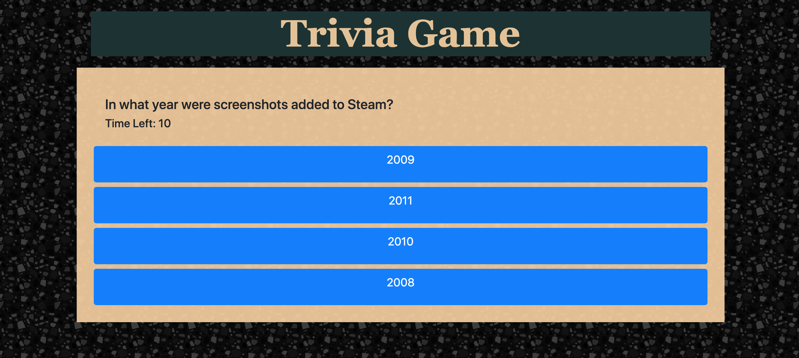
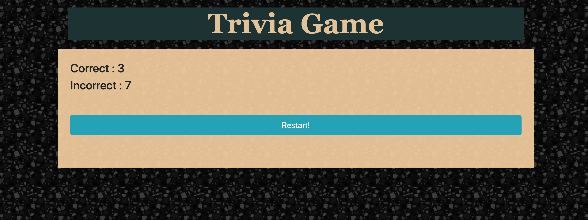

# Trivia Game

## Overview

Browser Trivia Game that shows the user questions one by one for ten questions. The user has 10 seconds to answer the questions. At the end of the questions the results are displayed to the user. The application gets the questions by making API calls to an open trivia api.

## Technologies Used

* HTML/CSS
* Javascript
* jQuery
* Open Trivia API

## Instructions

1. Press the start button to start the game. 
2. When the game starts questions will be displayed one by one.
3. There are 10 questions and 10 seconds to answer.
4. At the end of the game the users scores will be displayed

## Link

https://bogacsabuncu.github.io/TriviaGame/
